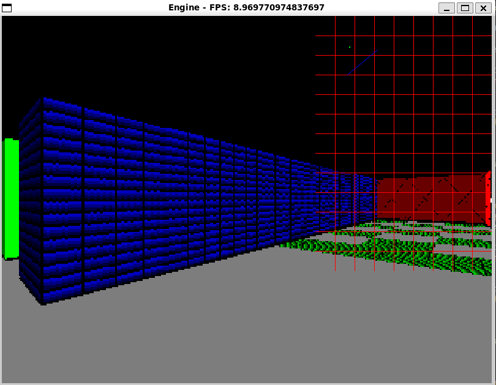

A simple raycasting engine in python using pygame. 

Python3 is required.

```
pip install -r requirements.txt
python engine.py
```




TODO (in no particular order):

* ~~Use opengl instead of pygame for rendering~~: It goes against the initial intent of the project, which is avoiding offloading everything to a library
* Rethink how textures are scaled and rendered on wall blocks. I think it is necessary to consider character direction.
* Add support for side based textures:
    * Maybe generating a mapping between numbers and customized textures/objects so maps stay simple
    * Raycasting side detection is already implemented
* Add physics for player movement
* Add collision detection
* Implement floor and ceiling textures, maybe a custom object in the map that indicates both textures. No idea how to implement it, raycast towards the floor from a particular height?
* Implement shaders on textures